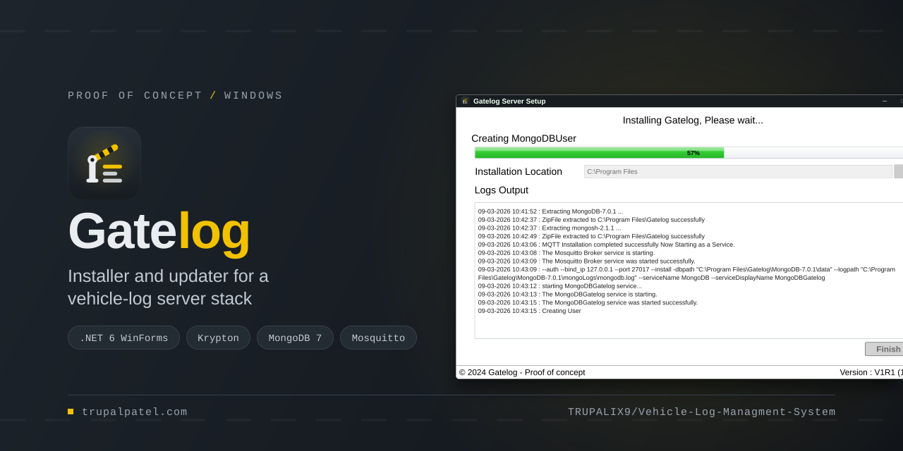
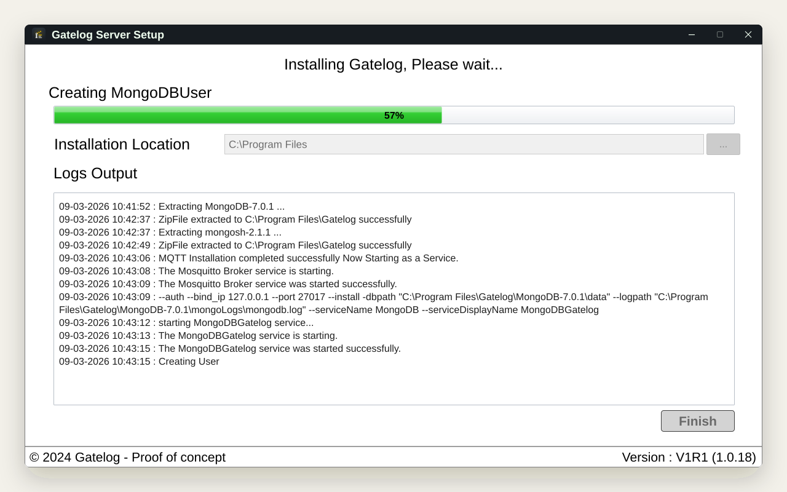
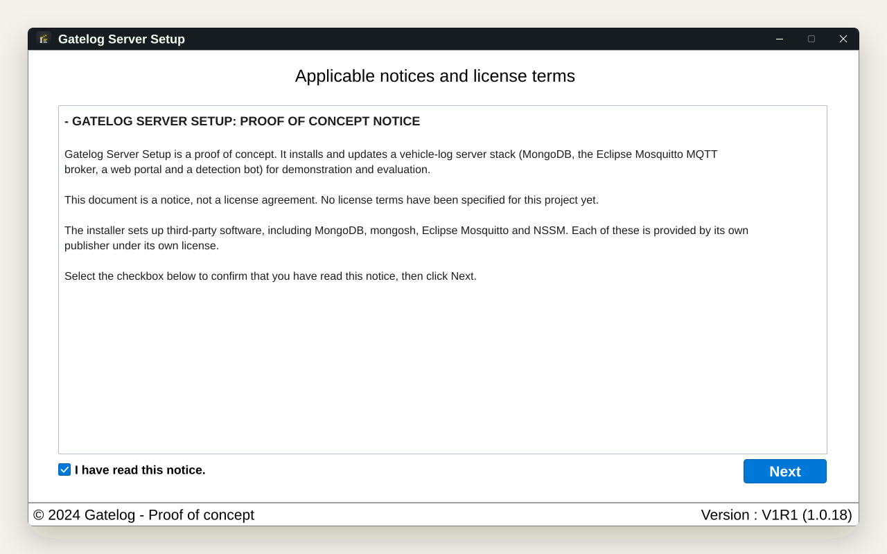
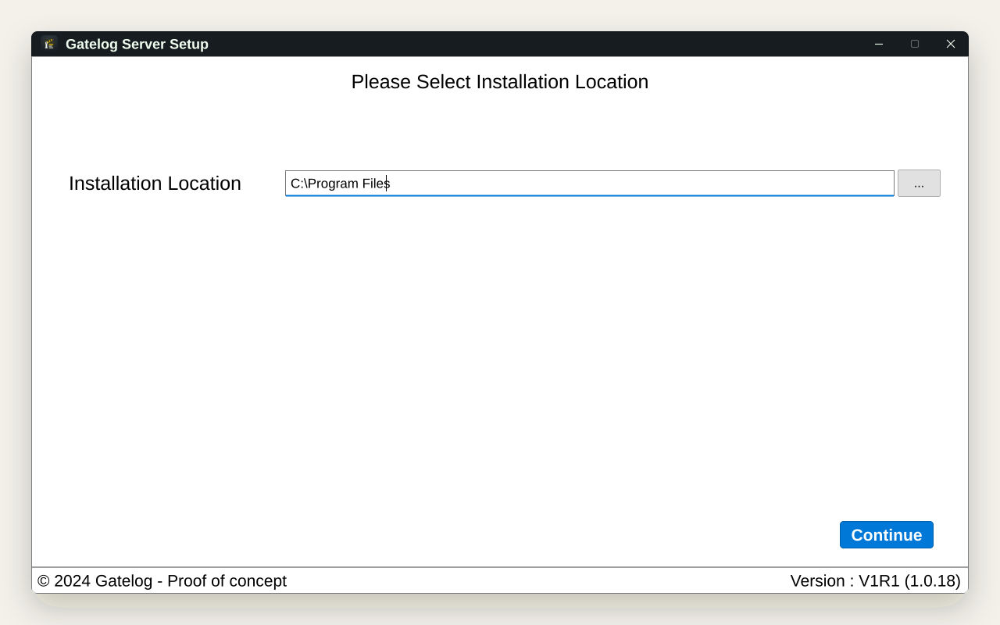
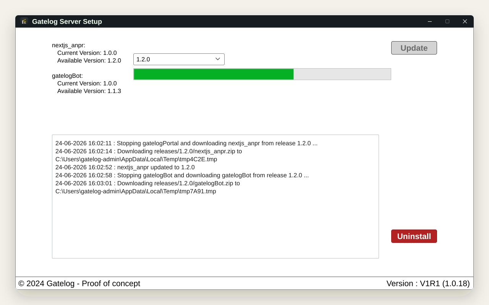
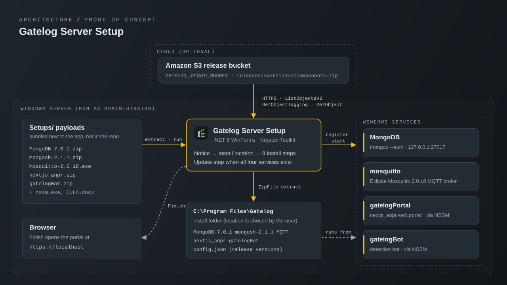

<p align="center">
  
</p>

<p align="center"><strong>Gatelog Server Setup is a proof-of-concept Windows installer and update wizard that brings up a vehicle-log server stack (MongoDB, an MQTT broker, a web portal and a detection bot) as Windows services.</strong></p>

<p align="center">
  <a href="https://trupalpatel.com/projects/vehicle-log"></a>
  
  
  
  
  
</p>

<p align="center">
  <a href="https://trupalpatel.com/projects/vehicle-log"><strong>Case study</strong></a> ·
  <a href="https://trupalpatel.com"><strong>Portfolio</strong></a>
</p>

---

## Overview

Setting up the server side of a vehicle-log (number-plate recognition) system on a Windows machine means installing a database, an MQTT broker, a web portal and a detection bot, then keeping them running and up to date. Gatelog Server Setup is a single WinForms app that does this: it relaunches itself as administrator, shows a notice, asks for an install location, then extracts the bundled payloads and registers each component as an auto-start Windows service. When the four services already exist, it opens an update screen that pulls newer releases from an S3 bucket.

> **Proof of concept.** This is an early prototype, not a finished product. The payload archives it installs are not part of this repository, so a fresh clone cannot run a real install, and the code has not been rebuilt or tested end to end since this refresh. See [Known limitations](#known-limitations).

## Features

- **Elevated relaunch**: restarts itself with the Windows `runas` verb and exits with a notice if administrator rights are declined.
- **Notice step**: loads `Setups/EULA.docx` with DocX into a read-only box; the Next button stays disabled until the checkbox is ticked.
- **Install location**: defaults to `C:\Program Files`, with a folder picker; the app creates a `Gatelog` folder there.
- **Eight-step install with live log**: extracts MongoDB 7.0.1 and mongosh 2.1.1, silently installs Eclipse Mosquitto 2.0.18 as a service, registers `mongod` as an auth-enabled service on `127.0.0.1:27017`, runs `createUser.js` in mongosh, extracts the portal and bot, and registers both with NSSM (auto-start, daily log rotation, restart on failure). A progress bar and a timestamped log follow each step, and the install stops at the first failed step.
- **Install or update detection**: if `gatelogBot`, `gatelogPortal`, `MongoDB` and `mosquitto` are all installed, the app skips straight to the update screen.
- **S3 update channel**: lists release folders newer than the installed `mainVersion`, shows current and available component versions, stops each service, downloads and extracts its zip over the install, restarts it and records the new version in `config.json`.
- **Uninstall script**: `Assets/uninstaller.ps1` stops and removes the four services and deletes the install folder.

## Screenshots

<table>
  <tr>
    <td align="center" width="50%">
      
      <br /><sub><b>Installing: progress bar and live log</b></sub>
    </td>
    <td align="center" width="50%">
      
      <br /><sub><b>Notice step</b></sub>
    </td>
  </tr>
  <tr>
    <td align="center" width="50%">
      
      <br /><sub><b>Choosing the install location</b></sub>
    </td>
    <td align="center" width="50%">
      
      <br /><sub><b>Updating from the S3 release bucket</b></sub>
    </td>
  </tr>
</table>

<sub>Screens are recreated from the app's real UI in SVG, filled with fictional demo data.</sub>

## Architecture

<p align="center">
  
</p>

The app reads the payloads bundled in `Setups/`, extracts them into the install folder and registers four Windows services: MongoDB and Mosquitto through their own installers, and the portal and bot through NSSM. On later runs it reads component versions from `config.json` in the install folder and compares them with the version tags on `releases/<version>/<component>.zip` objects in S3. Finish opens the portal at `https://localhost`.

## Tech stack

| Layer | Technology |
|---|---|
| App | C# on .NET 6 (`net6.0-windows`), Windows Forms, Krypton Toolkit 80.23 |
| Documents and config | DocX 2.5 (notice), Newtonsoft.Json 13 and System.Text.Json (`config.json`) |
| Services | System.ServiceProcess.ServiceController, NSSM (`nssm.exe`), `sc.exe` |
| Installed stack | MongoDB 7.0.1 and mongosh 2.1.1, Eclipse Mosquitto 2.0.18, the `nextjs_anpr` portal and the `gatelogBot` bot |
| Updates and delivery | AWSSDK.S3 3.7 (update channel), ClickOnce publish profile |

## Getting started

### Prerequisites

- Windows 10 or 11 (x64) and administrator rights
- .NET 6 SDK to build, or the .NET Desktop Runtime 6 to run (.NET 6 is out of support; retargeting is not part of this proof of concept)
- Visual Studio 2022 (optional; `VLMS.sln`)
- The installer payloads in `Setups/` (see below; they are not in this repository)
- For updates only: an S3 bucket laid out as described below, and AWS credentials that can read it

### Install

```bash
git clone https://github.com/TRUPALIX9/Vehicle-Log-Managment-System.git
cd Vehicle-Log-Managment-System
dotnet restore VLMS.sln
dotnet build VLMS.sln -c Release
```

Put these files in `Setups/` before building (the project copies `Setups/**` to the output folder). The names come from `Class/Global.cs`:

| File | Contents the installer expects |
|---|---|
| `MongoDB-7.0.1.zip` | a top-level `MongoDB-7.0.1/` folder with `bin/mongod.exe` |
| `mongosh-2.1.1.zip` | a top-level `mongosh-2.1.1/` folder with `bin/mongosh.exe` and your `bin/createUser.js` |
| `mosquitto-2.0.18.exe` | the Eclipse Mosquitto Windows installer |
| `nextjs_anpr.zip` | a top-level `nextjs_anpr/` folder with the portal executable `vlms.exe` |
| `gatelogBot.zip` | a top-level `gatelogBot/` folder with `gatelogBot.exe` |

### Environment variables

The app reads these from the Windows environment (it does not load `.env` files); set them with `setx` and restart the app. Names are listed in [`.env.example`](.env.example).

| Variable | Required | Description |
|---|---|---|
| `GATELOG_UPDATE_BUCKET` | For updates | S3 bucket holding releases. When unset, the update screen reports that the update server is not configured. |
| `GATELOG_UPDATE_REGION` | No | AWS region of the bucket. Default `us-east-1`. |
| `GATELOG_UPDATE_PREFIX` | No | Key prefix for release folders. Default `releases`. |
| `AWS_ACCESS_KEY_ID`, `AWS_SECRET_ACCESS_KEY`, `AWS_PROFILE` | For updates | Standard AWS SDK credential chain with read access to the bucket. |
| `GATELOG_INSTALL_URL` | For publishing | ClickOnce install URL used by `Properties/PublishProfiles/VLMS installer.pubxml`. |
| `GATELOG_CERT_THUMBPRINT` | For publishing | Thumbprint of your code-signing certificate for the ClickOnce manifests. |

Each release folder holds one zip per component, and each zip carries a version tag (the first tag's value is read):

```text
s3://<GATELOG_UPDATE_BUCKET>/releases/<version>/nextjs_anpr.zip
s3://<GATELOG_UPDATE_BUCKET>/releases/<version>/gatelogBot.zip
```

### Run

```bash
dotnet run --project VLMS.csproj -c Release
```

The app asks for administrator rights (UAC), then shows the notice step on a fresh machine or the update step when the four services are installed. After a successful install, Finish opens `https://localhost`. To remove everything, run from an elevated prompt:

```powershell
powershell -ExecutionPolicy Bypass -File Assets\uninstaller.ps1 -InstallPath "C:\Program Files\Gatelog"
```

### Known limitations

- The payload archives and `createUser.js` are not in the repository, so a clone cannot perform a real install.
- The Uninstall button explains how to run `Assets/uninstaller.ps1`; uninstall is not built into the app.
- Output from `mongod`, `nssm`, `sc` and `net start` goes to the log, but their exit codes are not checked, so a command that fails without throwing does not stop the install.
- No license file; licensing for this code is unspecified. The bundled notice (`Setups/EULA.docx`) is not a license agreement.

## Project structure

```text
Vehicle-Log-Managment-System/
├── Program.cs                 # entry point, relaunches elevated, runs Form1
├── Form1.cs                   # shell window: custom title bar, hosts the step controls
├── User Controls/             # EULAControl (notice), InstallerControl, UpdateControl
├── Class/                     # Global (names, env config), ServiceManager, UpdateManager, DataModel
├── Assets/                    # app icon, title-bar images, uninstaller.ps1
├── Setups/                    # notice document; installer payloads go here (not committed)
├── Properties/                # settings (install path) and the ClickOnce publish profile
├── nssm.exe                   # NSSM service manager, used to register the portal and bot
├── docs/assets/               # README banner, icon, screens, architecture
└── VLMS.sln                   # Visual Studio solution (internal project name VLMS)
```

`nssm.exe` is the NSSM service manager from [nssm.cc](https://nssm.cc). The minimize glyph in `Assets/icons8-minimize-32.png` is from Icons8. MongoDB, mongosh and Eclipse Mosquitto are distributed by their publishers under their own licenses.

## Author

**Trupal Patel**

<p>
  <a href="https://trupalpatel.com">Portfolio</a> ·
  <a href="mailto:trupal.work@gmail.com">trupal.work@gmail.com</a> ·
  <a href="https://www.linkedin.com/in/trupalix">LinkedIn</a> ·
  <a href="https://github.com/TRUPALIX9">GitHub</a>
</p>

Commit history also includes contributions from **hackershil**.
